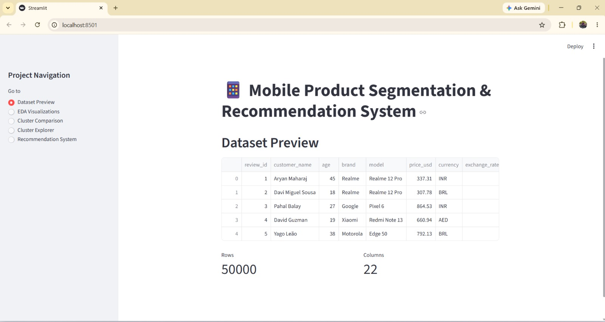
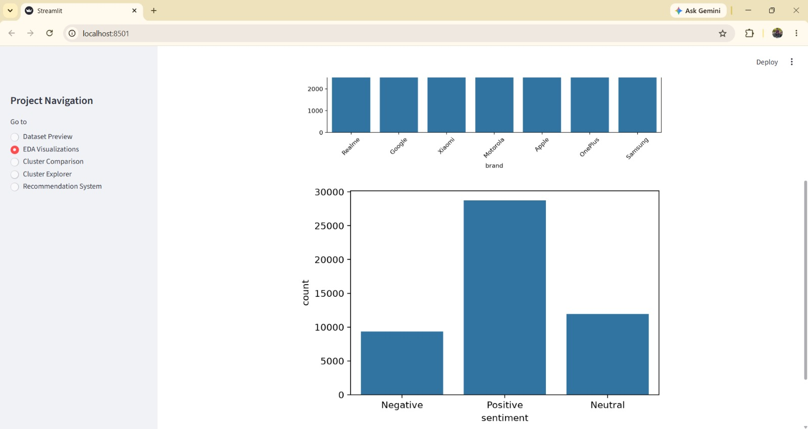
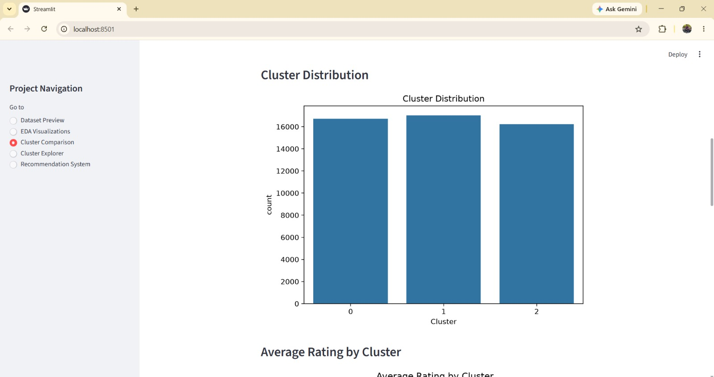
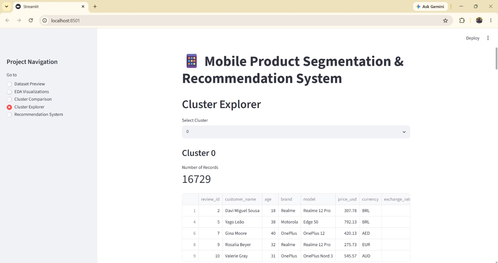
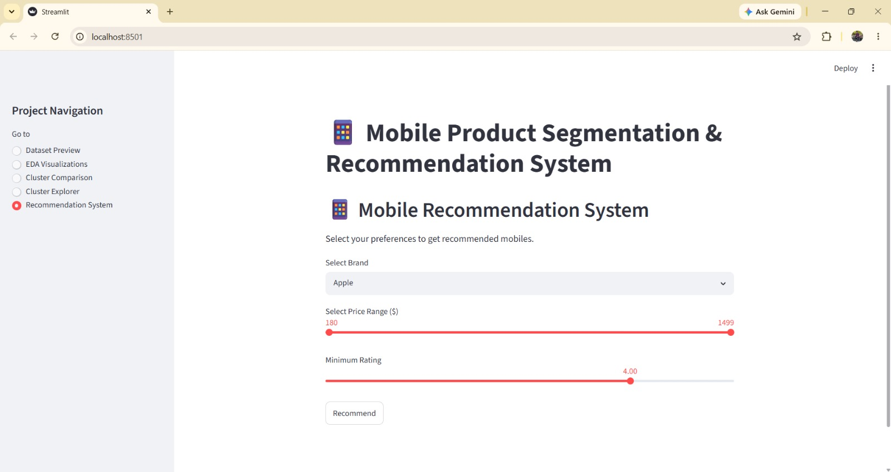
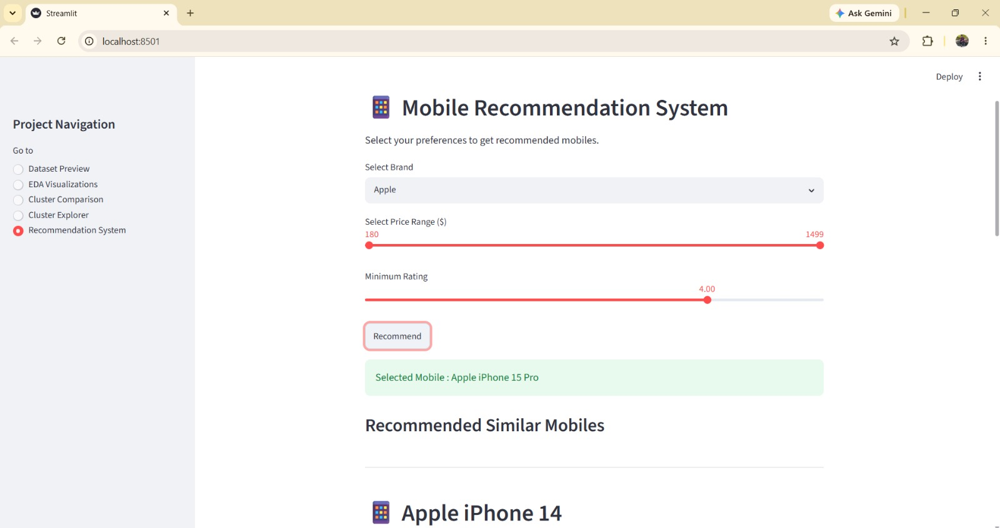

# 📱 Mobile Product Segmentation & Recommendation System

A machine learning project analyzing global mobile product reviews — combining K-Means clustering for product segmentation with a cosine-similarity-based recommendation engine, delivered through an interactive Streamlit dashboard.

---

## 📌 Project Overview

This project analyzes mobile phone reviews, ratings, pricing, product specifications, and customer sentiment collected across multiple brands and platforms.

The workflow covers data cleaning, exploratory data analysis (EDA), feature engineering, product segmentation using K-Means clustering, and a content-based recommendation system using cosine similarity. An interactive Streamlit dashboard lets users explore product clusters, compare segments, and get personalized mobile recommendations based on brand, price range, and minimum rating.

---

## 🚀 Tech Stack

Python · Pandas · NumPy · Matplotlib · Seaborn · Scikit-learn · Streamlit

---

## 📊 Key Features

**Data Analytics**
- Data cleaning & missing value handling
- Exploratory Data Analysis (EDA): brand distribution, sentiment distribution, price/rating distributions, correlation heatmap

**Feature Engineering**
- Feature selection across price, rating, and feature-specific scores (battery, camera, performance, design, display)
- Feature scaling with `StandardScaler`

**Product Segmentation**
- K-Means clustering (K=3, selected via the Elbow Method)
- Per-cluster analysis: brand distribution, sentiment, pricing, and feature ratings

**Recommendation System**
- Content-based recommendation using **cosine similarity**
- Computes similarity for the selected reference mobile against the full dataset (1×N), not a precomputed N×N matrix — avoids the ~18.6 GB memory cost a full similarity matrix would require at this dataset size
- User filters by brand, price range, and minimum rating; the top-rated match becomes the reference mobile, and the 5 most similar mobiles are returned

**Interactive Dashboard**
- 5 sections: Dataset Preview, EDA Visualizations, Cluster Comparison, Cluster Explorer, Recommendation System

---

## 📸 Screenshots

**Dataset Preview**


**EDA Visualizations — Sentiment Distribution**


**Cluster Comparison**


**Cluster Explorer**


**Recommendation System — Inputs**


**Recommendation System — Results**


---

## 📁 Project Structure

```
Mobile-Product-Segmentation-Recommendation-System/
├── Data/
│   └── Mobile Reviews Sentiment null.csv
├── docs/
│   ├── Mobile_Project_Presentation.pptx
│   └── Mobile_Product_Segmentation_Report.pdf
├── screenshots/
│   ├── dataset_preview.jpeg
│   ├── eda_visualizations.jpeg
│   ├── cluster_comparison.jpeg
│   ├── cluster_explorer.jpeg
│   ├── recommendation_inputs.jpeg
│   └── recommendation_result.jpeg
├── app.py
├── Global_Mobile_Project.ipynb
├── final_mobile_reviews.csv
├── requirements.txt
├── .gitignore
└── README.md
```

> ⚠️ **Path note:** `app.py` loads `final_mobile_reviews.csv` from the current working directory (no subfolder), and `Global_Mobile_Project.ipynb` loads the raw dataset via the relative path `Data/Mobile Reviews Sentiment null.csv` — capital `Data`, exact spacing. Both the notebook and the app must be run **from the repository root** for these paths to resolve. The local `Data/` folder must be capitalized to match (not `data/`), since GitHub paths are case-sensitive.

---

## ⚙️ How to Run

**1. Clone the repository**
```bash
git clone https://github.com/meetthaheerhere-ds/Mobile-Product-Segmentation-Recommendation-System.git
cd Mobile-Product-Segmentation-Recommendation-System
```

**2. Install dependencies**
```bash
pip install -r requirements.txt
```

**3. (Optional) Regenerate the processed dataset**

`final_mobile_reviews.csv` is already included in the repo, so this step is optional. To reproduce it from scratch, run `Global_Mobile_Project.ipynb` top to bottom from the repository root — it reads the raw data from `Data/`, performs clustering, and writes `final_mobile_reviews.csv`.

**4. Launch the dashboard**
```bash
streamlit run app.py
```

---

## 🤖 Machine Learning Workflow

**Data Preprocessing**
- Dataset loading, missing value handling, duplicate checks

**Exploratory Data Analysis**
- Brand distribution, sentiment distribution, price/rating analysis, correlation heatmap

**Feature Engineering**
- Feature selection (price, rating, and 5 feature-specific ratings)
- Feature scaling via `StandardScaler`

**Product Segmentation**
- Elbow Method to select K
- K-Means clustering (K=3)
- Per-cluster profiling

**Recommendation System**
- User selects brand, price range, and minimum rating
- Highest-rated matching mobile becomes the reference
- Cosine similarity ranks the rest of the dataset against that reference
- Top 5 most similar mobiles (excluding the reference itself) are displayed

---

## 📊 Cluster Insights

**Cluster 0 – Average Performance Mobiles** (16,729 records)
Moderate customer ratings and balanced feature scores across battery, camera, performance, and display — suitable for everyday users.

**Cluster 1 – High Performance Mobiles** (17,033 records)
Highest customer ratings and feature scores across all categories — the best-performing segment.

**Cluster 2 – Low Performance Mobiles** (16,238 records)
Lowest customer ratings and feature scores, indicating weaker customer satisfaction.

---

## 📈 Key Insights

- Premium smartphones generally receive higher customer ratings
- Price alone does not determine customer satisfaction — feature quality and sentiment matter more
- K-Means clustering successfully segments the market into three distinct, interpretable groups
- Cosine similarity recommendations reflect the reference mobile's specifications and rating profile rather than brand alone
- Customer sentiment correlates with overall product ratings

---

## 🎯 Project Outcome

- Cleaned and processed a 50,000-row mobile review dataset across 7 brands
- Built a K-Means clustering model for product segmentation (Elbow Method, K=3)
- Developed a memory-efficient cosine-similarity recommendation system
- Created a 5-section interactive Streamlit dashboard
- Generated cluster-level and dataset-level business insights

---

## 📌 Future Enhancements

- Deploy on Streamlit Community Cloud
- Explore a hybrid recommendation approach combining collaborative and content-based signals
- Add NLP-based sentiment analysis directly on review text (current sentiment field is a pre-labeled category, not derived from free text in this pipeline)
- Persist the trained scaler and cluster assignments as saved artifacts, rather than relying on `Cluster` being baked into `final_mobile_reviews.csv`

---

## 👨‍💻 Author

Thaheer

